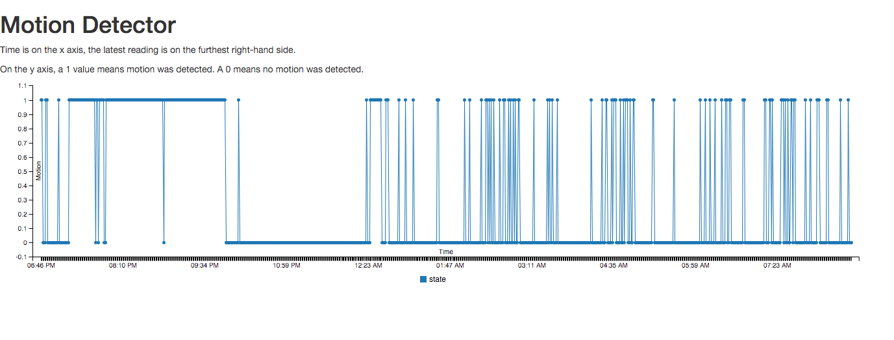

##CIR Motion Detector
Experimenting with raspberry pis to take regular sensor readings and push the findings
to a local website.

Using [this guide](http://www.mattrichardson.com/Raspberry-Pi-Flask/index.html)
for the Flask server.

##How I think this works
`runSensor.py` runs the GPIO pins and logs the data every second. A True(1)
value means motion was detected. A False(0) value means motion was not
detected. 

The script checks the GPIO pins for 1s or 0s every second writing the value to
stdout. If 1 or more True values were detected in the previous 60 seconds, the
script will log a 1 and the timestamp to `data/pir_state.csv.` If 60 False
values were sensed, the script writes the timestamp and a 0 to
`data/pir_state.csv`.

Note: this is a rather inexact way to take a reading each minute. However, it
appears to be accurate within one second. Moreover, this is not a time-critical
application. From my research, it seems like an Arduino would be a better
choice for time-critical applications anyway as Python and the Linux OS might
do things to prevent exact timing.

A Flask app `app.py` reads the csv and charts the values on the local network.
Flask is actually not doing anything special here and one could probably get
away with using Python SimpleServer to get this data online.

On reboot, `app.py` runs and also `runSensor.py` in the background. I use
`nohup` to run the sensor in the background so that it won't stop. That sends
its stdout to `nohup.out`. To get a realtime view of what the sensor is
sensing, enter `tail -f nohup.out`.

The log files in on the Pi were getting enormous, so `clearLog.sh` will force
the system's native log rotater to run hourly.

The system backs up a single day worth of data at midnight via
`backupSensorData.py`. The logs tend to fill up fast, and so I run a script
`clearLogs.sh` on an hourly cron job to prevent the tiny SD card from filling
up.
